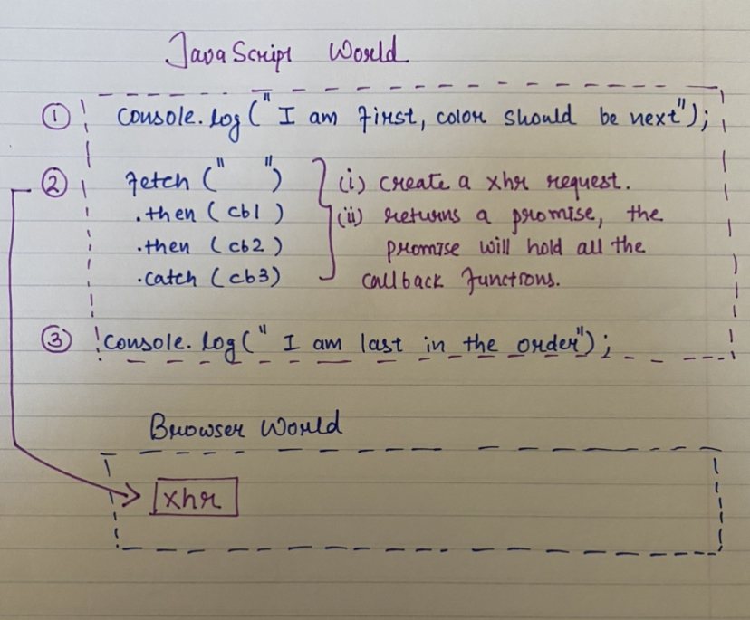
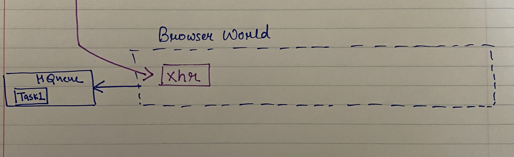

:rocket:
It certainly brings a lot of concepts together when a fetch request is made.
Let us have a look.

List of concepts we will need to understand fetch, we sure wont go too deep but enough to understand it quickly.

- [ ] Javascript boundary, browser features
- [ ] Promise object
- [ ] Microtask queue

## Javascript doesn't know how to talk to internet.

Javascript does not know how to talk to internet innately.
Browser has the ability to talk to the internet. So it has Fetch API that is available to
developers to be used in Javscript as **fetch function**

_Image of Javacsript Border_

_Based on Browser Border_

## Since I promised, Lets talk about it.

Promise is another object that javascript offers. It is a place holder for the values of future.
It can be in one of the three states. :wink:

- pending: initial state, neither fulfilled nor rejected.
- fulfilled: meaning that the operation completed successfully.
- rejected: meaning that the operation failed.

## What is microtask queue

Just another queue to store things to do next, but it exists to falicitate the javascript world do asynchronous things.

Promise and microtask will be covered more in details in later blog but for now they are introduced to understand the big picture
of how they all work come together to make fetch work.

# :drum:

Now since we have covered what we need, lets talk about the execution of below code.

```javascript{numberLines: true}
console.log("I am first, color should be next")

fetch("https://api.noopschallenge.com/hexbot")
  .then(response => {
    return response.json()
  })
  .then(data => {
    const colorValue = data.colors[0].value
    console.log(`color value is ${colorValue}`)
  })
  .catch(err => console.log(JSON.parse(err)))

console.log("I am last in the order")
```

```
// output is
I am first, color should be next
I am last in the order
color value is (some random color)
```



So it start from the top of the file, where we have the console.log statement to
log _I am first,color should be next_. Then it will come down to execute the fetch statement,
since **fetch** is an api, it calls the browser to fulfill the request and return a promise object
as a placeholder, the promise object will hold all the callback functions passed in the _then_ and _catch_.

Now what, after the promise is returned it will not wait for the fetch request to be completed, it will move on to execute what is next.
It will execute the final console.log statement _I am last in the order_. But what happened to our fetch :question:

Once the network request returned with the result, the microtask queue comes in to play, where the task is pushed by the browser back into javascript world once the network request is completed.



When the javascript has nothing to execute _(when the stack is empty)_ :wink:. It checks the microtask queue for any more task, which sure does have when the fetch is completed, the task gets out from the queue (dequed) and push on to the stack for javascript to execute. In our case, the task resolve the promise to console.log statement with a random color value. That is the reason the color comes last even it executes before the last console.log statement.

I always like to try things, so here is an example code for you to play. [Try your hands on the example](https://jsbin.com/vutaya/edit?js,console)
